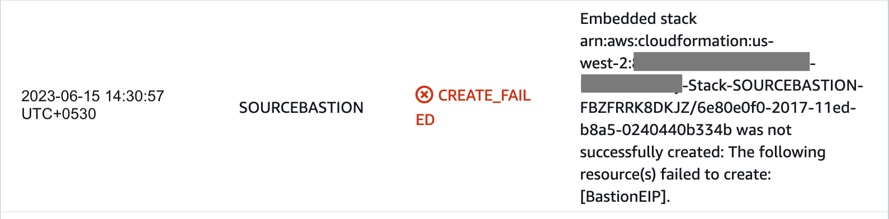
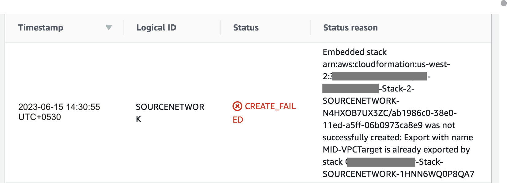
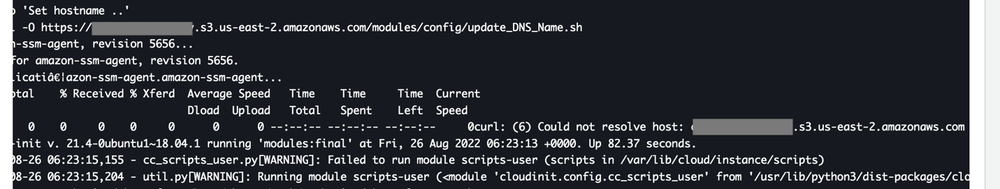

# CloudFormation Stack Failure <!-- MODIFY THIS HEADING -->

<!--## Submodule One Heading <!-- MODIFY THIS SUBHEADING -->

<!-- This paragraph block should be an introduction to the submodule.-->

<!-- - **Note**: Ignore this section if Stack is in “CREATE_COMPLETE” state.-->
{}
Ignore this section if Stack is in “CREATE_COMPLETE” state.  
{}

- CloudFormation template fails to deploy if resource limits are reached.
    - Example: EIP limit reached
    
    
    
    - Mitigation
        - Make sure you have sufficient resources as per limits described under above section **AWS Resource Limits**
- CloudFormation template fails with error similar to “Export with name MID-VPCTarget is already exported by stack **{Some Stack Name}**
    - Example:
    
    
    
    - Mitigation
        - Make sure you don’t have any other "Omnideq-App-Modernization-Role-Stack and "Omnideq-App-Modernization-Stack" named CloudFormation Stacks in your account
        - Delete the previous cloudformation stack and retry deploying current stack
- Stack may fail to deploy OmniDeq BuildBox
    - Mitigation
        - Redeploy the stack as this issue may be intermittent
    
    