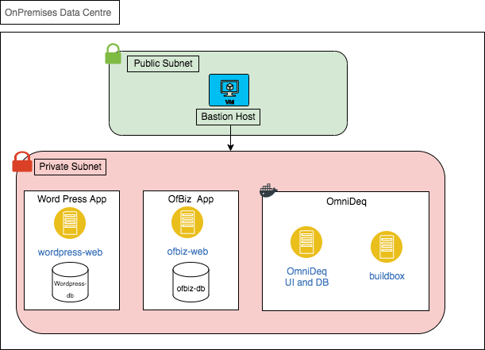

# Setup Architecture
Below is the Architecture of the setup.

There are 2 applications running with respective Databases along with OmniDeqTM in private Subnet

- Wordpress Application
    - wordpress-web
    - wordpress-db
- OfBiz Application
    - ofbiz-web
    - ofbiz-db
- OmniDeqTM Appliance
    - OmniDeqTM appliance with DB
    - Buildbox