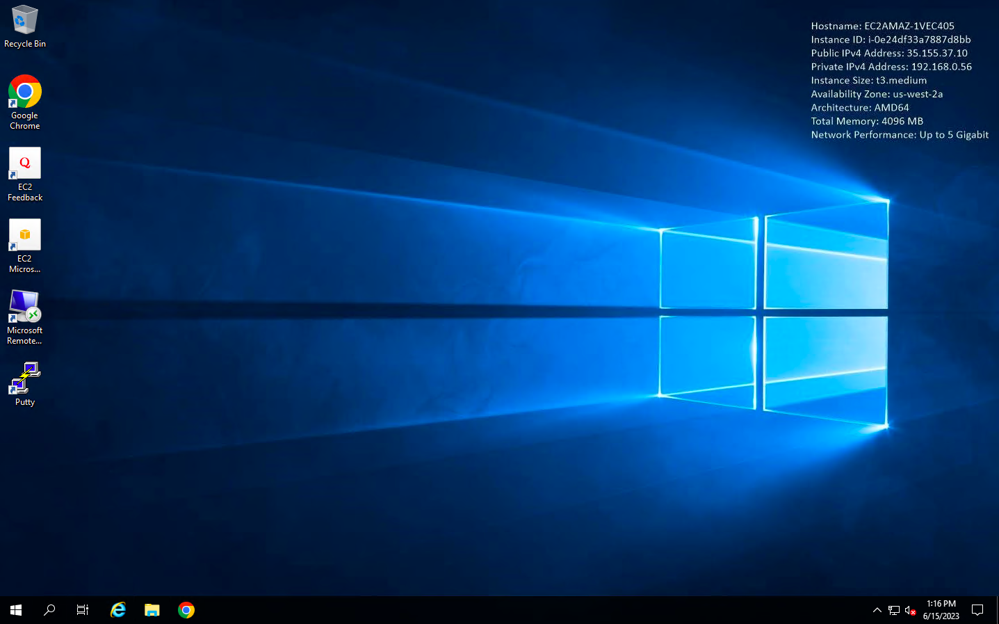
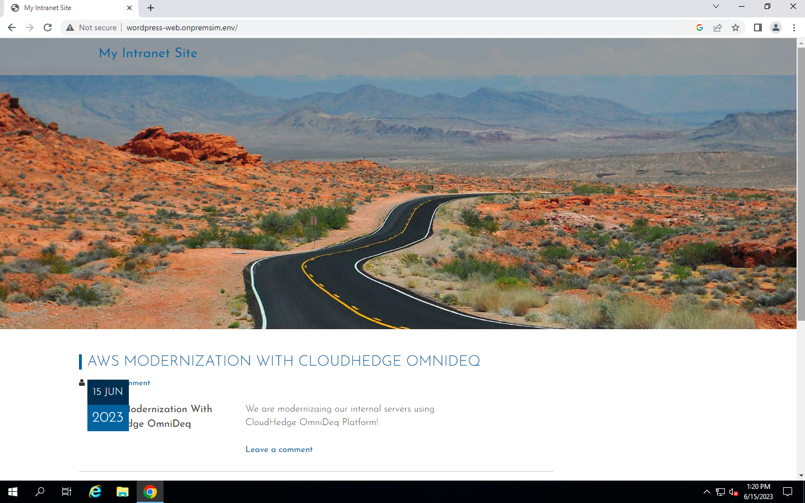
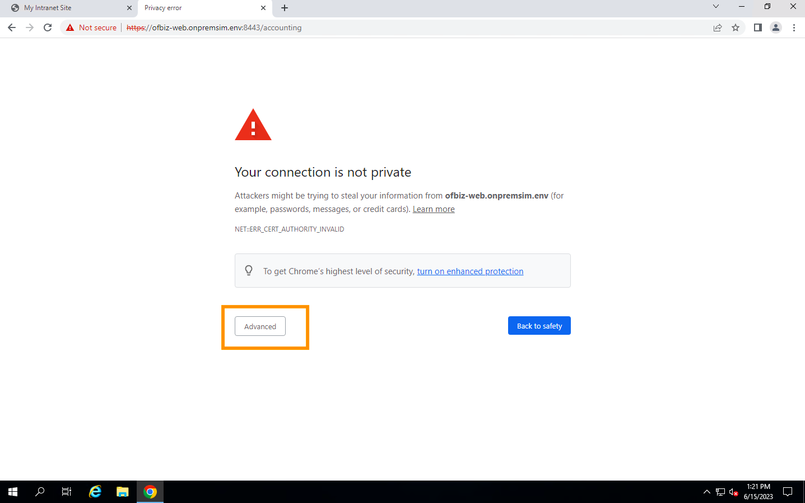
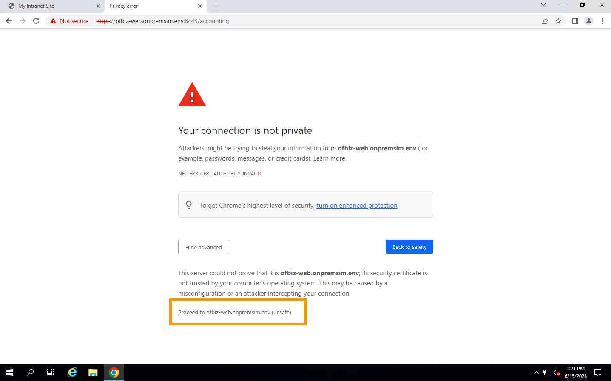
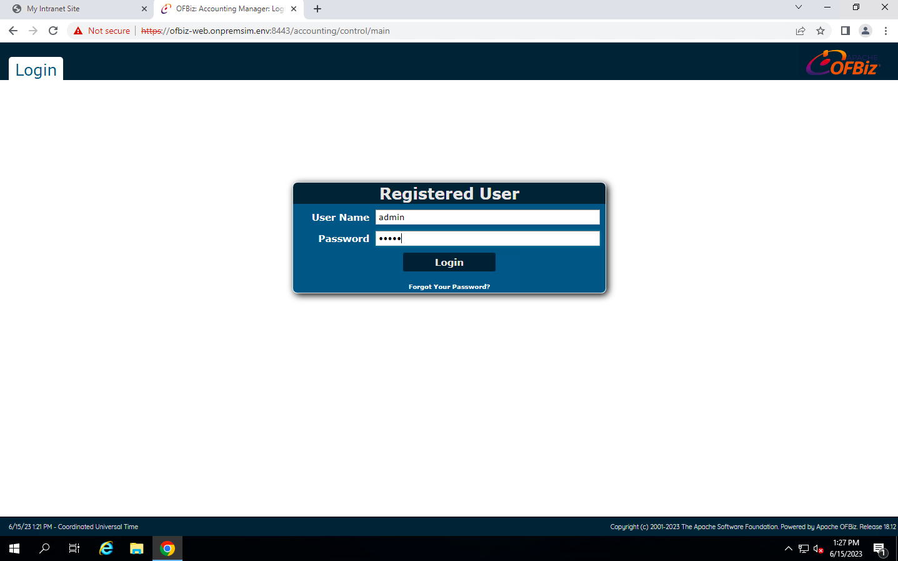
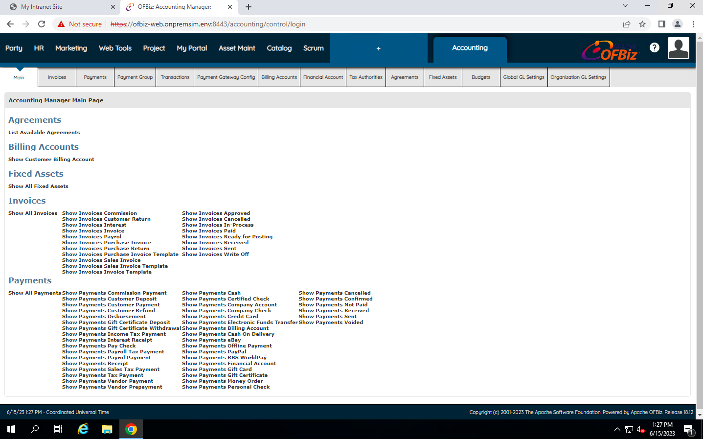

# Login to the environment
- Sign in into your [AWS Console](https://signin.aws.amazon.com/) using an account with administrative privileges
- Select appropriate Region – **us-west-2** / **Oregon**
- Connect to the bastion host using the information provided in CloudFormation Output
- Copy the IP address corresponding to BastionRDP
  from output section
    - On AWS Portal ->-> Navigate to EC2 Service Dashboard ->-> Click on Instances -> Search with the IP address of BastionRDP
    - Or search for instance with the name “MID-Bastion”
- Select the instance and click on **Connect**. Click on **RDP client** section, scroll down and click on  **Download remote desktop file**. This should download the RDP file to connect to Bastion Host.
- Once downloaded double click on the file and fill in below credentials
    - Username: Administrator
    - Password: Provide password that was used under the field “AdminPassword” while creating the CloudFormation template
- Upon successful login you should be able to see Bastion windows machine

- The current production environment running on-premise is comprised of 2 applications and 4 servers as per the following:

| Application | Hostname       | FQDN                        | OS      | Platform   |
|-------------|----------------|-----------------------------|---------|------------|
| Wordpress   | wordpress- web | wordpress-web.onpremsim.env | Centos7 | Apache+PHP |
| Wordpress   | wordpress- db  | wordpress-db.onpremsim.env  | Centos7 | MariaDB    |
| OFBiz       | ofbiz-web      | ofbiz-web.onpremsim.env     | Centos7 | Java       |
| OFBiz       | ofbiz-db       | ofbiz-db.onpremsim.env      | Centos7 | PostgreSQL |

- Test the applications that we’re going to migrate. In the Bastion Host, open the following URL using Chrome browser
    - Refer to output section URL’s
        - WordPressWebsiteURL
        - OfBizWebsiteURL
- If you have not modified DNS Name you can use sample URL’s as below

| Application | URL                                             |
|-------------|-------------------------------------------------|
| Wordpress   | http://wordpress-web.onpremsim.env/             |
| OFBiz ERP   | https://ofbiz-web.onpremsim.env:8443/accounting |

- Wordpress Application

- OFBiz Application

    - Credentials for OfBiz application are
        - admin
        - ofbiz
