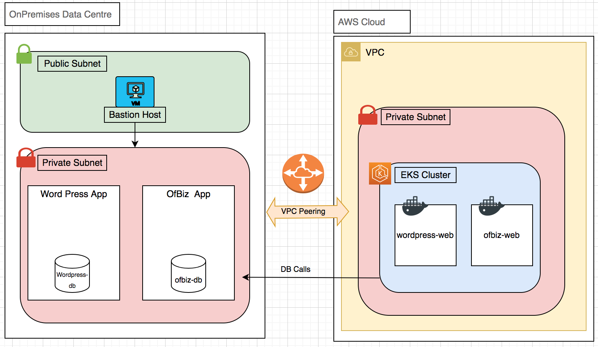
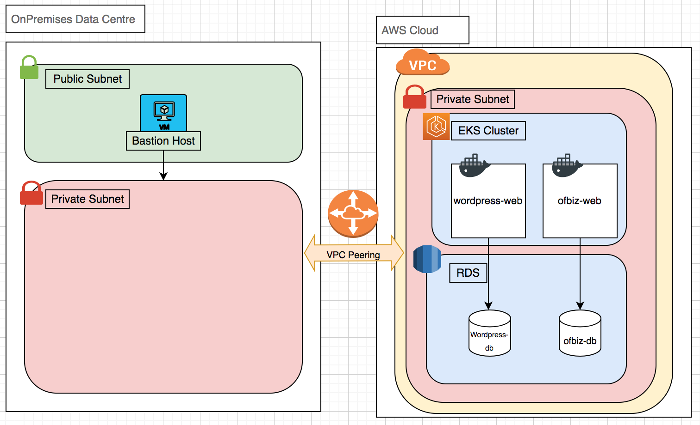

# Post modernization using CloudHedge OmniDeqTM

- Post following the steps described in this document you will be able to containerize the applications and deploy them over EKS Kubernetes cluster
- If you choose not to migrate the database(s), setup will look as below

- If you choose to migrate the databases to AWS RDS the migrated setup will look
as below
