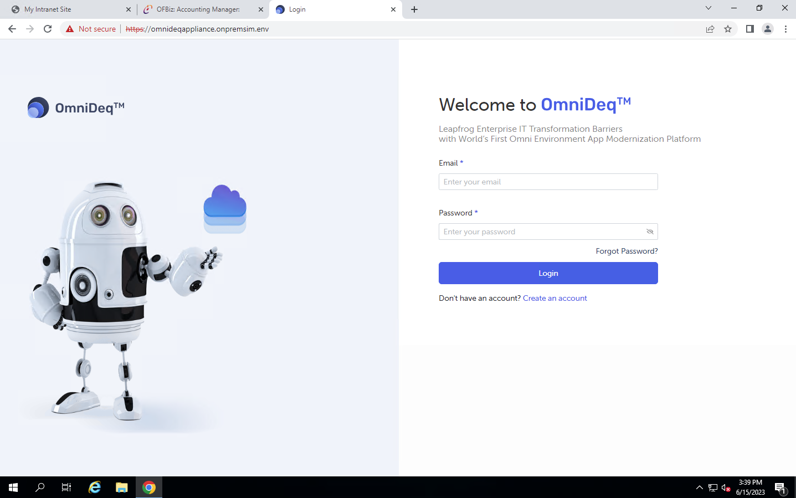

# Setup CloudHedge OmniDeqTM

- Let’s get started with the modernization and set up the OmniDeqTM platform.
- Login to CloudHedge
    - Login to OmniDeqTM from Bastion machine using Chrome Browser 
        - From Output Variables copy the value of
            - OmniDeqApplianceURL
                - If not modified below should be the value
                    - https://omnideqappliance.onpremsim.env
                    - Username: onprem@cloudhedge.io
                    - Password: CH1mmersionD@y

    

<!-- - Steps to create a New User
    - Go to Settings -> User and click on “Add User”
    ### Add Screenshot here and remove this span
    - Enter the following values in the “AddUser”form that gets loaded (as shown) and click on “Save”:
        - **Name** - Full Name of the Project-specific Developer / Tester
        - **Email** – Email ID of the Project-specific Developer / Tester
        - **Password** / **Confirm Password** – Desired Password (to be changed upon first login)
        - **Access Type** - “Admin”
    ### Add Screenshot here and remove this span
    - Logout from the current session.
    - Login to OmniDeqTM from Bastion machine using Chrome Browser.
        - From Output Variables copy the value of
            - OmniDeqApplianceURL
                - If not modified below should be the value
                    - https://omnideqappliance.onpremsim.env/
                    - Username: Email ID of the Project-specific Developer / Tester
                    - Password: Password of the Project-specific Developer / Tester
        - The “Terms of Service” is displayed upon login. Read and scroll-down to the end of the document then select the “I Agree” checkbox and click on “OK”.
        - The “Change Password” form is displayed.Enter the following values and click on Change Password”.
            - Current Password - Password of the Project-specific Developer / Tester
            - New / Confirm Password - New Password of the Project-specific Developer / Tester
    ### Add Screenshot here and remove this span
    - Your session will be automatically signed out and you will be requiredto login again with the newly changed password.
- Steps to configure Password Vault
    - Password (Username / password) vault helps to connect to application machine securely over SSH connection
    - Steps: From Main Menu Go to Settings -> Vault
     -->
    
- Click on Add Vault: (Top Right Side of the screen)
    - Name: Give friendly name to vault e.g.: app_login
    - Vault type: Select Password
    - Username: **user**
    - Password: Provide password that was used under the field
    “RootPassword” while creating the CloudFormation template
    - Click on Save
    
    

- Steps to configure BuildBox
    - Build Box is a machine which has docker installed
    - This is a separate box as OmniDeqTM doesn’t alter the state of the machine the application is running on
    - From the Vault Screen Click on Add Vault: (Top Right Side of the screen) 
    - Provide Friendly Name to Build Box eg: ch-buildbox
    - Vault Type:Scroll and select “BuildBox”
    - Select Container Type as“Linux”
    - Username: user
    - Host: From Output Variables of “Omnideq-App-Modernization-Stack” copy the value of
    “BuildBoxPrivateIP” 
    - Port 22
    - Connection Type: Scroll and select “Basic”
    - Select BuildBox Credential Vault from drop down: app_login 
    - Click on “Validate & Save”
    
    

- Steps to configure ECR Registry
    - From the Vault Screen Click on Add Vault: (Top Right Side of the screen) 
    - Provide friendly Name: ECR_Registry
    - Vault Type: Scroll and Select Typeas: Container Registry
    - Registry Type: Select "ECR"
    - Server:
        - From Output section of “Omnideq-App-Modernization-Stack” copy the value of RegistryURI
        - **Note**: Do not use "Copy Link" as it will automatically prepend "https://" which is not a valid ECR Registry address. Instead, just copy the text from the CloudFormation outputs
    - Container registry credentials: Select “Use Instance Role”
    - Click on Save

    

- Modify APP HOST
    - **Note**: Ignore the error notification“App host url - Error while fetching App host url” as we are going to set up APP Host in following steps.
    - Go to Settings -> Configurations -> App Host tab
    
- Enter the Callback URL as OmniDeqTM Appliance URL (Make sure to remove trailing slash)
    - From Output Variables of “Omnideq-App-Modernization-Stack” copy the value of
        - OmniDeqApplianceURL
            - If not modified below should be the value
            - https://omnideqappliance.onpremsim.env
            - **Note**: Make sure there are no leading or trailing white spaces, and no trailing slash 
    
    