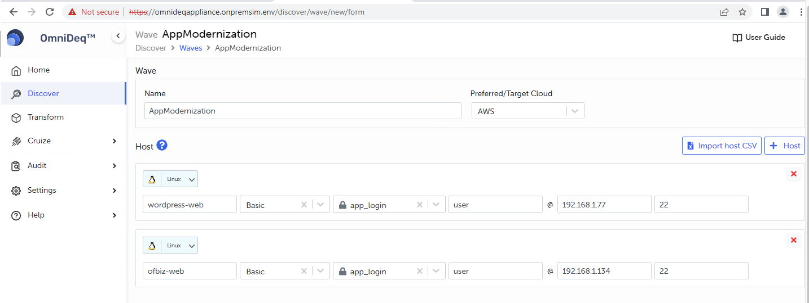
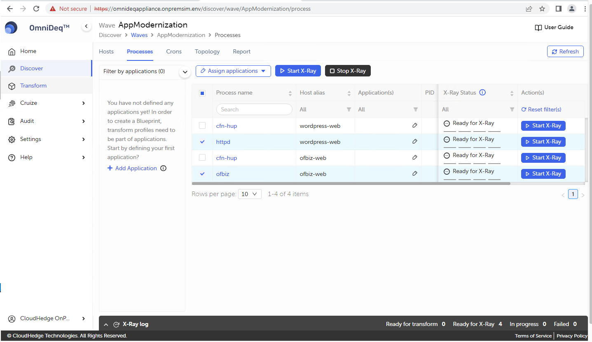
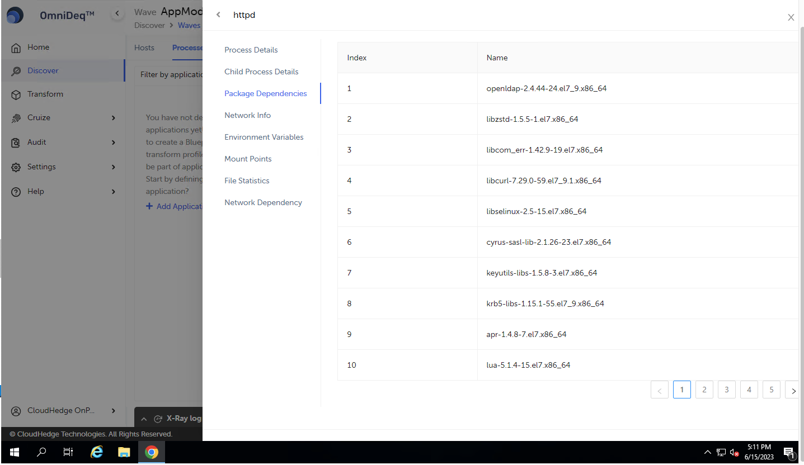

# Discover

- Click on the OmniDeqTM Link and login with credentials
- User will be redirected to Home Page of OmniDeqTM
    
- Now Click on Discover Application or Discover Menu in Left Panel
- Click on the “Discover” -> “Add Wave”
    
- Under Wave provide
    - Name: AppModernization
    - Preferred/TargetCloud: AWS
- Under Host we need to provide details of wordpress-web and ofbiz-web
- For Wordpress:
    - Alias: wordpress-web
    - Connection: From dropdown select Basic
    - Vault Name:app_login (Select Password Vault created earlier)
    - Username: user (Auto populated)
    - HostName/IP: From output variable of “Omnideq-App-Modernization-Stack” copy value of
    “WordPressWebPrivateIP” 
    - Port: 22
    - Alternate way to find / verify PrivateIp select host “MID-Wordpress-WEB”
    
      

    

- Click on +Host (Right Side of the screen) and proceed to add details of ofbiz-web
- For Ofbiz web:
    - Alias: ofbiz-web
    - Connection: From dropdown select Basic
    - Vault Name: app_login (Select Password Vault created earlier)
    - Username: user (auto-populated)
    - HostName/IP: From Output Variables of “Omnideq-App-Modernization-Stack” copy the value of
    “OFBizWebPrivateIP”
    - Port: 22
    - Alternate way to find/verify PrivateIp select host “MID-OFBiz-WEB”
    
      

    
    
    - Click on Save to save the wave details
- Under Discover Tab -> Click on the Created Wave (AppModernization)-> To view more details
- Now Select Both Host Added in Wave and Click on “Check Connection” This will check the connection with source host from OmniDeqTM appliance and if it succeeds, connection icon turns green

- Once connection is successful, click on “Check Prerequisites” This will check the prerequisites required for OmniDeqTM appliance for further operations: If it succeeds, icon turns green

- Click on “Discover” Button to discover the host under wave, wait for few minutes to complete the discover operation. This operation will discover and identify the running processes

- Once Discovery is completed click on the “Processes” tab on the Discover to view the discovered processes

- Notice how OmniDeqTM does not know any details of the application but using discovery it will capture all the relevant details to help containerize the application
- Notice 4 processes are shown
    - Processes **httpd** and **ofbiz** are the ones we are interested in. As they are our application processes
    - **Note**: Cfn process are CloudFormation agents which ran on the machine to report back machine state to CloudFormation
- Now we will perform X-Ray to fetch additional information about the processes
- Select 2 processes httpd and ofbiz and click on “Start X-Ray” and click on Confirm
    - X-Ray fetches additional information about the app

    

- Perform Application specific operation so that x-ray captures the details in OmniDeqTM appliance
    - Click on Confirm
    - And navigate to the application pages and click on refresh icon.
        - Navigate to the wordpress application and refresh the site. 
        - Navigate to the OfBiz application and refresh the site.
        - **Note**: OfBiz application takes time to load [So wait for 5-10 mins] if the page isn’t loading.
    
    
    
    
- Current X-Ray status is “Perform functional test”. Once you have performed application specific operations as mentioned in above step, we can now stop X-Ray.
- Stop X-Ray: Select processes and click on stop x-ray. Check the checkbox and click on Confirm.

    <!-- ###  Add STOP X-RAY screenshot here -->
    
- Post stopping the x-ray operation, OmniDeqTM performs analysis. Wait for a while for analysis to complete.
    - This might take few minutes [5-10mins].

    

- On successful analysis. You will see status “Analysis complete” under “X-Ray Status” column.
- You can click on each process [click on process name eg: httpd] and check details as shown in the screen below:

- Child Process Details:

- Package Dependencies: OmniDeqTM captures all dependent packages for process

- Network Info: OmniDeqTM fetches all **“Network Info”** both **Inbound** and **Outbound**
    - Notice how Mysql connection is automatically identified along with the FQDN and IP address
    - Similar information for DNS server is captured.

    <!-- Below is the old image-->
    <!--  -->
    

- Click on other tabs like “Environment Variables”, “File Statistics” etc. get view of all the captured information
- Click on Network Dependencies to get list of files responsible for networking configuration for process

- Topology of application:
    - Click on topology to see how the application interacts with whole ecosystem

    <!--  -->
    
- Group the processes to form application
    - Navigate to Discover page and select the wave and click on Processes
    - Select httpd profile. Click on Assign application. Select a desired color for the application and enter wordpress in the text-field as shown and click on Add.
    
    
    
    - Select the newly-created application from the drop-down list and click on Assign.
    - Repeat the above process to similarly create and assign an application, by the name of ofbiz, with the ofbiz process.
    
    