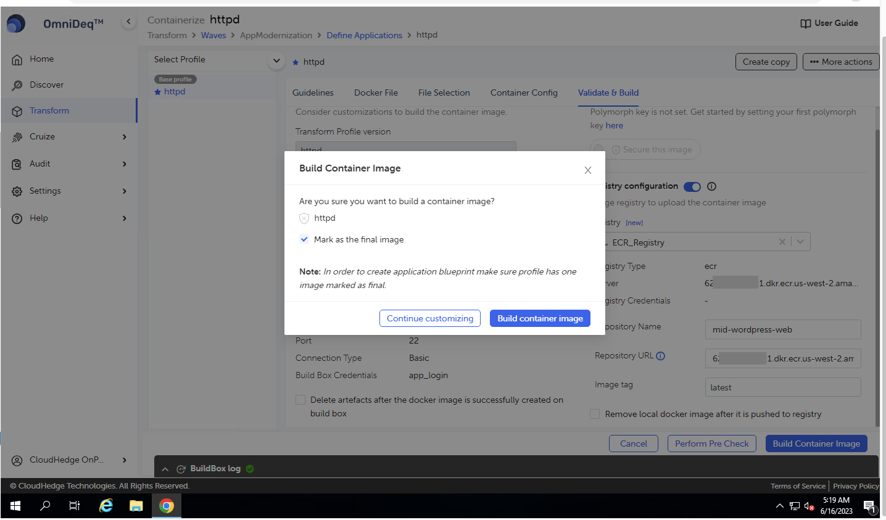
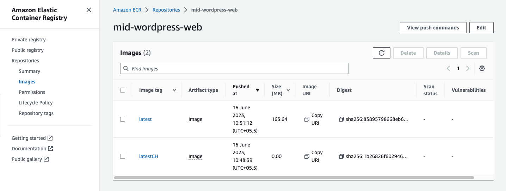

# Transform

{}
In order to transform both **applications** you will have to repeat the below steps for each process. Steps mentioned below will guide you with **httpd** repeat same steps for **ofbiz** (migrating ofbiz is optional).
{}

- Select Process httpd -> click on “Go to Transform” [Right hand side of the screen along the process name]

    - This will help us to containerize application   

    

    - Clicking on “Containerize” will redirect to Transform Wizard:   

    
    
    - Now in Transform Wizard, continue clicking on “Proceed” till wizard redirect to “Validate & Build” Page
    
    - In “Build Box Details” [Centre of the Screen]
        - From Buildbox dropdown select: ch-buildbox [BuildBox added earlier]
    
    - In “Registry configuration” [Centre of the Screen]
        - From Registry dropdown select : ECR_Registry [Registry added earlier]
        - Now the Page should look as below: [Refresh the screen if “Validation successful” is not shown]
     
    
        - On this page Provide Registry Details:
            - Repository Name:
                - For wordpress-web:
                    -  mid-wordpress-web
                - Forofbiz-web
                    - mid-ofbiz-web
            - Image Tag
                - latest
            - User has option to:
                - Delete artifacts after the docker image is successfully created on build box
                - Remove local docker image after it is pushed to registry
            - Select both checkboxes.
                - After Validating all Details on “Validate and Build” Page Click on Build Container Image
                - In the pop-up dialog-box that opens up, select the check-box against the option as shown: Mark as final image and click on Build container image
    <!--  -->
    
    - Click on the “Transform Log” at the bottom of the screen and wait till “Auto containerization completed” logger comes up
    
    

- Once Transform Process completes, It Pushes the container image into ECR registry as selected in transform wizard, see below sample
- On AWS console navigate to ECR service and select appropriate repository to view the image

    

- Verify the Name of Image Tag under AWS -> Repository -> **{ECR_RepositoryName}**
- [ **Note** ] Repeat the same process for ofbiz (migrating ofbiz is optional)
    - You don’t need to add buildbox or ECR_registry again. Reuse the one created during wordpress transformation and select them in appropriate dropdown.
    - Repository name for ofbiz is “mid-ofbiz-web”
    - As ofbiz is bit heavy application containerization may take up to 15 minutes.

    

- Verify both the applications are containerized before proceeding with Cruize 
- Navigate to “Transform” from left hand side menu. Click on the wave “**AppModernization**”
- Verify the status of both “httpd” and “ofbiz” is “Container image ready” under
column status. [On Right side of the screen]