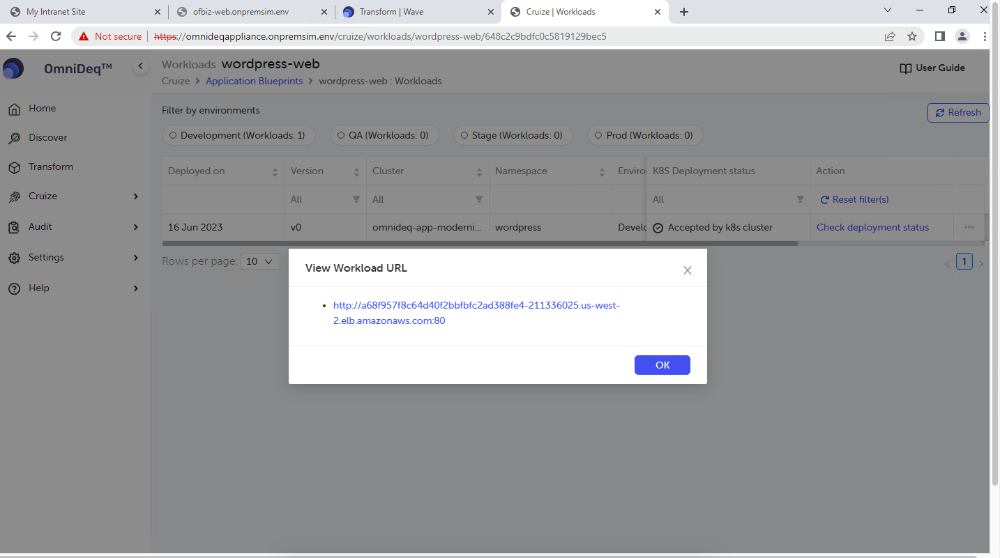

# Cruize
To perform Cruize operation, the user needs to add a Deployment Target which points to an existing EKS cluster. Please follow the steps mentioned in the next section to map your existing EKS cluster to CloudHedge OmniDeqTM.

**Deployment Targets**

- Before setting up the cluster in OmniDeqTM we need to fetch the Kubeconfig file. Please follow the below-mentioned steps to fetch the required Kubeconfig file:
    - RDP to the AWS Bastion Host provisioned in the Source VPC.
    - Open Putty, load and open the saved session named “buildbox” to SSH into the CloudHedge Build Box.
    - You will be asked to enter the password for the local sudoer account named “user” to authenticate your SSH shell session.
        - Enter the password of “RootPassword” field while creating the CloudFormation template
    - Perform the following commands and verify the results against the attached snapshot to verify that your SSH session is loaded for the correct machine:

        $ whoami  
        $ hostname  
        $ cd scripts/  
        $ pwd  
        $ ls –larth  
    
    

    - We will generate service account required to fetch the kubeconfig file for the target EKS cluster
        - Identify the AWS REGION where the target EKS cluster is deployed.
        - Identify the EKS CLUSTER NAME of the target EKS cluster.
        - Perform the following command and verify the results against the attached snapshot to ensure that the required Kube are loaded as expected: 
        ./configure_eks_service_account.sh {AWS_REGION} {EKS_CLUSTER_NAME} 
{}
If you have not modified any default parameters in CloudFormation Script you can copy paste below command.
{} 
        ./configure_eks_service_account.sh us-west-2 omnideq-app-modernization-eks 
        
{}
Ignore 2 Errors at the start of the script. Output should look like below screenshot
{} 
        - To locate the newly-generated kubeconfig file, navigate to /home/user/scripts/ and locate the file named as follows:

            $ cd /home/user/scripts  
            $ ls –lrt  
            $ cat {FILE_NAME_WITH_BELOW_FILE_FORMAT}  
            
            kubeconfig-{EKS_CLUSTER_NAME}-k8sappmodernization-{CURRENT_DATE_TIME}.yaml  
        
            example: 
        
            kubeconfig-aws-appmodernization-eks-k8sappmodernization-2023-06-16-12-00-00.yaml
        
        - Copy paste the content of this file we will use it in next step

- Navigate to “Cruize -> Clusters” from the main menu
- We are going to use “BYOC” aka "Bring Your Own Cluster" feature
- Once on “Clusters” page click on “Bring Your Own Cluster” on the top-left hand side
of the page
<!--  -->

- Enter the below details
    - Cluster Name: omnideq-app-modernization-eks
    - Description: AWS Modernization with CloudHedge OmniDeq workshop EKS Cluster
    - Orchestration Engine: From dropdown select Amazon Elastic Kubernetes Service
    - Cluster config file: Click on Enter Config file contents
    - Enter the previously copied config file contents in the corresponding text-field as shown:

    

    - Click on Validate and fetch cluster details. If the cluster gets validated, the following sections should get populated:

    

    - Click on Save Cluster. Verify the cluster has been imported successfully

    

**Application Blueprint**

- Application Blueprint is user friendly way to create Kubernetes based deployments
- Blueprint helps user to have minimum understanding of Kubernetes yaml files and
helps to version control all the deployments

**Create Blueprint**

- Navigate to Transform -> AppModernization -> Transform Applications
- Verify that the following two application cards should get listed on the screen with
their status set to Containerization complete
    - wordpress
    - ofbiz

     

{}
You will have to repeat the below process for **Ofbiz** application. Modifying the keyword wordpress to ofbiz everywhere. (migrating ofbiz is optional)
{}

- For wordpress, click on Create blueprint then click on Continue Blueprint Creation as shown

    

- In the dialog-box that pops up, enter the following values:
    - Application Blueprint name: wordpress-web

    

- Click on Create Application Blueprint
- Click on Deploy in Cruize
- Navigate to **Cruize -> Application Blueprints -> wordpress-web -> [Click on] Versions
-> wordpress-web**

    

- Click on Edit deployment definition under **Deployments -> httpd**
    
    
    - Verify that the value of the base image URL populated against Containers -> Image -> Image URL is set to the following value:
        - From Output section check RegistryURI
        - Image URL: RegistryURI/mid-wordpress-web
    

    - Verify that the value of the base image URL populated against Containers -> Image -> Port is set to 80
    - Click on Service [horizontal tab menu on the screen] -> httpd -> Actions -> Edit
    
    
    - Select Load Balancer from the Service type drop-down menu
    
    
    - Click on Port Mapping -> Add Container Port(s) and select httpd then select Add ports
{}
In case of ofbiz you will see multiple ports. Keep them as is and click Add ports.
{}
    <!-- --> 
    
    
    - Click on Update
    

    - Note: If you are updating ofbiz delete all the other port-mappings except port 8443 and click on Update

**Create Deployment Workload**

- Navigate to **Cruize -> Application Blueprints -> wordpress-web -> Versions -> wordpress-web -> Action -> Create workload** [Right hand of the screen]
- Once clicked you will see below screen

    

- Populate the following value against the stated fields: 
    - Workloadname:wordpress-web
    - Cluster:omnideq-app-modernization-eks
- Click on Validate

    <!-- -->
    

- Click on Next

    

- Click on Start Workload Deployment

    

- Navigate to Cruize -> Application Blueprints -> wordpress-web -> Deployed workloads
- Verify that the status of K8S Deployment status is set to Accepted by k8s cluster

    

- Click on the kebab menu (3 dots) next to the **Action** column and select **View workload Summary** and verify that there are no red crosses displayed in the list of **Config File** records against the **Deployed Config** column

    

[ **Note** ]: You will have to repeat the above process from similar note above. For Ofbiz application. Modifying the keyword wordpress to ofbiz everywhere. (migrating ofbiz is optional)

 
**DNS Update**

- Run nslookup before updating the DNS and notice its currently pointing to the private IP of the Virtual Machine

    $ nslookup wordpress-web.onpremsim.env

    

    $ nslookup ofbiz-web.onpremsim.env
    
    

- As deployment is completed we will now update DNS entries to point to newly deployed services FQDN.
- Follow the below steps to update DNS records:
    - Navigate to **Cruize -> Application Blueprints -> wordpress-web -> Deployed workloads**
    - Click on the kebab menu (3 dots) next to the Action column and select Workload URL and copy the URL that gets displayed in the pop-up dialog box as shown:

    

    - Copy the FQDN from this url (by removing http(s) and slash and port number) 
        - For wordpress: Port 80
        - For Ofbiz: Port 8443
    - We will refer to this FQDN as INTERNAL_FQDN
    - From putty logon to buildbox provide the credentials set via creating the cloudformation template (RootPassword)
    - On buildbox navigate to **/home/user/scripts** directory 
        $ cd /home/user/scripts
    - Locate the script: **update_DNS_Name.sh**
    - Steps to run the script: Sample Examples below
        - **./update_DNS_Name.sh** {DNS_NAME} {SERVICE_NAME} {INTERNAL_FQDN}
        - Example: **./update_DNS_Name.sh** onpremsim.env wordpress-web INTERNAL_FQDN
{}
Notes: 
**1.** Modify **{DNS_NAME}** if you have changed it while deploying CloudFormation template.  
**2.** Verify **{SERVICE_NAME}** use appropriate names while running the scripts  
**3.** Verify **{INTERNAL_FQDN}** does not have http(s):// 
**4.** Verify **{INTERNAL_FQDN}** does not have :PORT_NUMBER at the end 
{}

- For Wordpress-Web
    - **./update_DNS_Name.sh** onpremsim.env wordpress-web {INTERNAL_FQDN}
    - Example: **./update_DNS_Name.sh** onpremsim.env wordpress-web  a53eebb2b10e54eeeb6252fe268ede5d-412180175.us-west-2.elb.amazonaws.com
    - Run nslookup after running the script and notice now DNS points to Load balancer 

    $ nslookup wordpress-web.onpremsim.env

    

- For Ofbiz-Web
    - **./update_DNS_Name.sh** onpremsim.env ofbiz-web {INTERNAL_FQDN}
    - Example: **./update_DNS_Name.sh** onpremsim.env ofbiz-web a67928a67b5114c63ad39f8468318056-1161902874.us-west-2.elb.amazonaws.com
    - Run nslookup after running the script and notice now DNS points to Load balancer  
    $ nslookup ofbiz-web.onpremsim.env
    
    

- Now both Application are now pointing to containerized services
- Enter the original URLs to access wordpress app and ofbiz app
    - Refer to output section URL’s
        - WordPressWebsiteURL
        - OfBizWebsiteURL
    -  If you have not modified DNS Name you can use sample URL’s as below

    | Application | URL                                             |
|-------------|-------------------------------------------------|
| Wordpress   | http://wordpress-web.onpremsim.env/             |
| OFBiz ERP   | https://ofbiz-web.onpremsim.env:8443/accounting |